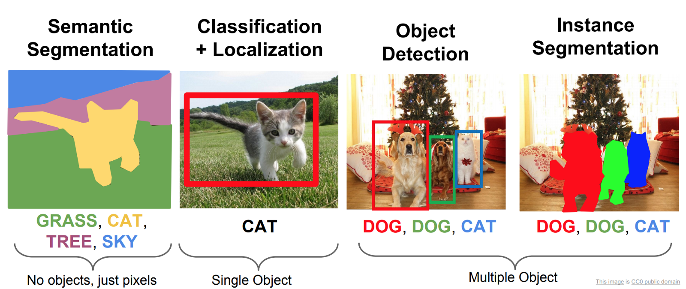

# Tutorial for tensorflow image classification 

Different  image processing techniques with deep learning:



## Requirements
Windows 
Anaconda installation:  https://www.anaconda.com/distribution/  

## Prepare the environment
In a CMD write following commands

```
$conda create -n train_class python=3.6
```

```
activate train_class
```

( move to the directory where you want your project i.e.  cd D:\CIAT\Cenicana_train\)

mkdir kagle


